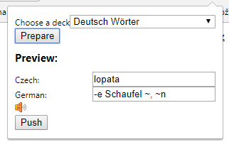

# AnkiSeznamChromeExt
Chrome extensions that lets you add notes based on czech - german translation from slovnik.seznam.cz 

# Setup
1. Add AnkiConnect to your desktop Anki application - https://foosoft.net/projects/anki-connect/
2. Add this exstension to Chrome. -> Go to Extension settings tab and drag and drop the src folder there. Developer mode has to be enabled. More info here - https://developer.chrome.com/extensions/getstarted#unpacked
3. Get rid of the anonying warning that you are using an extension in developer mode - run the patchChrome.bat as administrator with Chrome shut down - https://stackoverflow.com/questions/30287907/how-to-get-rid-of-disable-developer-mode-extensions-pop-up

# Usage
1. Run Anki on your computer
2. Go to slovnik.seznam.cz and translate some german word.
3. Click on the extension -> popup window opens.
4. Select deck where you want to add the note.
5. Hit prepare to load values from page.
6. Push the note into your Anki. Done.

